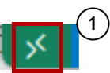
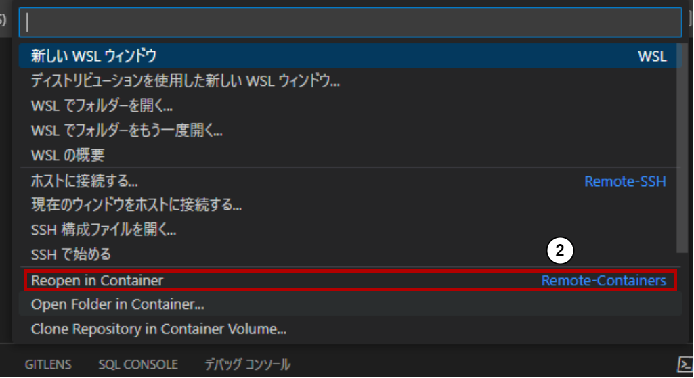

# PHPコード研修
PHPコード研修用 リポジトリ

## Install

### Docker
- **公式サイト**: [Docker](https://www.docker.com/products/docker-desktop)<br>https://www.docker.com/products/docker-desktop
- **手順**:
  1. 公式サイトから Docker Desktop をダウンロード
  2. インストーラーを実行
  3. インストール完了後、Docker Desktopを起動

### VSCode
- **公式サイト**<br>[Visual Studio Code](https://code.visualstudio.com/)<br>https://code.visualstudio.com/
- **手順**:
  1. 公式サイトからダウンロード
  2. インストーラーを実行
  3. インストール完了後、VSCodeを起動

### DevContainer の導入
- **公式サイト**: [Developing inside a Container](https://code.visualstudio.com/docs/remote/containers)<br>https://code.visualstudio.com/docs/remote/containers
- **手順**:
  1. VSCode起動
  2. 拡張機能タブから "Remote - Containers" 検索、インストール

## 実行
### DevContainer での起動
DevContainerを使用する

1. 左下を押してコマンドを表示<br>

2. 「Reopen in Container」を選択<br>


### Docker Compose での起動
DevContainerを使わない、使えない環境での環境の場合。

- 起動
```sh
$ cd ./.docker/
$ docker compose up -d
```

- 停止
```sh
$ docker compose down
```

- PHPコンテナへの入り方
```sh
$ docker exec -it php /bin/bash
```
